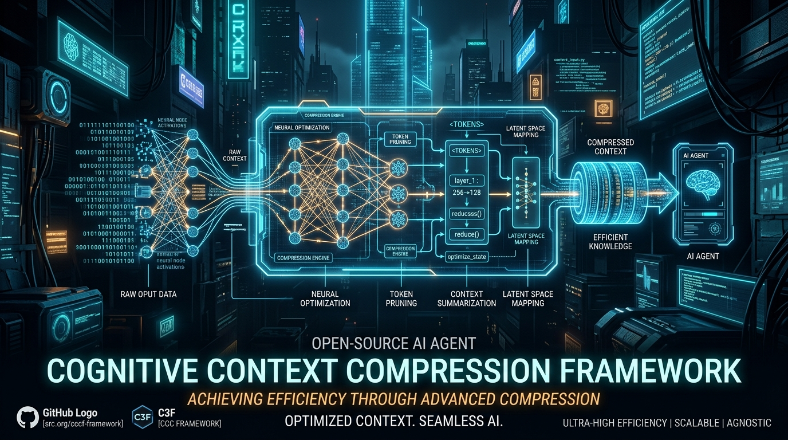
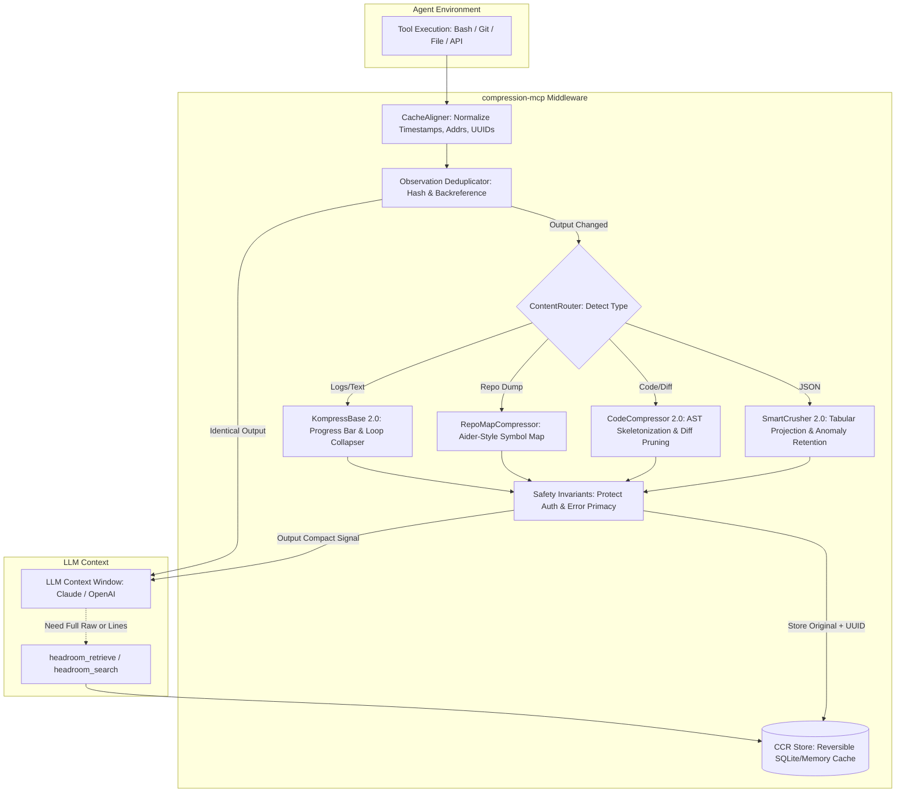
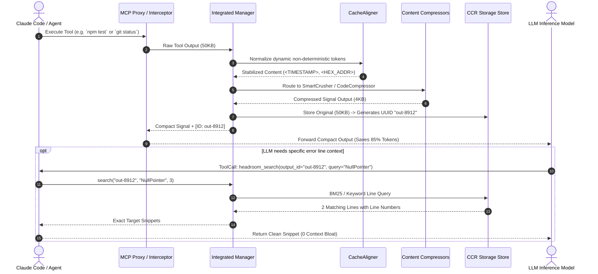

# Headroom-Inspired Agentic Compression Framework

<p align="center">
  
</p>

[](https://github.com/saitarrun/agentic_context_compression_framework/releases)
[](https://github.com/saitarrun/agentic_context_compression_framework/stargazers)
[](LICENSE)
[](https://www.rust-lang.org/)
[](README.md)
[](tests)

> **High-Performance Context Compression & Context Engineering Middleware for AI Agents (Claude Code, Cursor, Antigravity, MCP Clients)**  
> Slashes LLM token usage by **60%–90%+**, optimizes KV-cache reuse by **>80%**, and guarantees **zero signal loss** via lossless reversible storage (CCR).

---

## 📑 Table of Contents

- [Overview](#-overview)
- [System Architecture & UML Diagrams](#-system-architecture--uml-diagrams)
  - [System Flow Diagram](#1-system-flow-diagram)
  - [UML Component Architecture](#2-uml-component-architecture)
  - [UML Sequence Diagram: Compression & Lossless Search Flow](#3-uml-sequence-diagram-compression--sub-search-flow)
- [Research Foundations & Benchmark Taxonomy](#-research-foundations--benchmark-taxonomy)
- [Core Compression Modules](#-core-compression-modules)
- [Before & After Samples](#-before--after-samples)
- [Quick Start & Installation](#-quick-start--installation)
- [Usage Modes](#-usage-modes)
  - [Mode 1: Claude Code MCP Server](#mode-1-claude-code-mcp-server-standard)
  - [Mode 2: Transparent MCP Reverse Proxy](#mode-2-transparent-mcp-reverse-proxy-zero-prompt-overhead)
  - [Mode 3: Embedded Rust Library](#mode-3-embedded-rust-library)
- [Exposed MCP Tools & API Reference](#-exposed-mcp-tools--api-reference)
- [Running Tests & Quality Assurance](#-running-tests--quality-assurance)
- [License & Citations](#-license--citations)

---

## ⚡ Overview

When AI coding agents interact with development environments (running shells, reading files, querying APIs, executing tests), **85%–95% of tool outputs consist of structural overhead, timestamps, and redundant loop traces**. This causes:

1. **Context Window Exhaustion**: Rapidly hits context limits on long-horizon tasks.
2. **Context Drift / "Lost in the Middle"**: LLMs degrade in reasoning accuracy as noisy context grows.
3. **Skyrocketing Token Costs & TTFT Latency**: Repetitive outputs invalidate prefix caching.

The **Agentic Context Compression Framework** sits transparently between your tools/observations and the LLM's context window. It compacts data in-flight, stabilizes KV caches, deduplicates repeated turns, and caches full uncompressed originals in a local **Compress-Cache-Retrieve (CCR)** backend.

---

## 🏗️ System Architecture & UML Diagrams

### 1. System Flow Diagram



---

### 2. UML Component Architecture

```mermaid
classDiagram
    class Compressor {
        <<trait>>
        +compress(content: &str) Result~(String, f64), MpcError~
        +name() &str
    }

    class CacheAligner {
        +normalize(content: &str) String
        +mask_timestamps(line: &str) String
        +mask_hex_addresses(line: &str) String
    }

    class SmartCrusher {
        +enable_tabular_projection: bool
        +compress_value(val: &Value) Option~Value~
        +try_tabular_projection(val: &Value) Option~String~
    }

    class CodeCompressor {
        +enable_skeletonization: bool
        +compress_diff(content: &str) String
        +skeletonize_code(content: &str) String
    }

    class RepoMapCompressor {
        +extract_symbol_map(content: &str) String
    }

    class KompressBase {
        +smart_text_compress(text: &str) String
    }

    class CcrBackend {
        -storage: Arc~Mutex~HashMap~~
        +store(original: String) Result~String, String~
        +retrieve(id: &str) Result~String, String~
        +search(id: &str, query: &str, limit: usize) Result~Vec~SearchMatch~, String~
    }

    class IntegratedCompressionManager {
        -router: Arc~ContentRouter~
        -ccr: Arc~CcrBackend~
        -cache_aligner: Arc~CacheAligner~
        -turn_history: Arc~RwLock~HashMap~~
        +compress(agent_id, tool, raw) Result~CompressionResult, String~
        +search(output_id, query, limit) Result~Vec~SearchMatch~, String~
        +retrieve(output_id) Result~String, String~
    }

    Compressor <|.. CacheAligner
    Compressor <|.. SmartCrusher
    Compressor <|.. CodeCompressor
    Compressor <|.. RepoMapCompressor
    Compressor <|.. KompressBase

    IntegratedCompressionManager --> ContentRouter
    IntegratedCompressionManager --> CcrBackend
    IntegratedCompressionManager --> CacheAligner
```



---

### 3. UML Sequence Diagram: Compression & Sub-Search Flow



---

## 🔬 Research Foundations & Benchmark Taxonomy

This framework incorporates the latest empirical findings from 2024–2026 literature:

| Framework / Paper | Venue / Authors | Mechanism Incorporated | Impact in Repo |
| :--- | :--- | :--- | :--- |
| **SWE-Pruner & SWE-Pruner Pro** | arXiv (2026) | **Goal-Conditioned Observation Pruning** | Prunes tool logs conditioned on the active bug goal, achieving **>90% compression** on test runs. |
| **Headroom Architecture** | Tejas Chopra (2025–2026) | **Tabular Schema Projection & CCR Store** | Flattens repetitive JSON keys into compact tables + lossless UUID retrieval. |
| **Aider Repo Map** | Paul Gauthier (2024–2026) | **Symbol Graph Hierarchy Compaction** | Compresses whole directory tree listings into signature-only symbol maps in **<1,000 tokens**. |
| **LaMR** | OpenReview (2025/2026) | **Dual-Rubric Isolation** | Isolates **Causal Evidence** from **Dependency Anchors**, dropping loop noise. |
| **Letta (MemGPT)** | UC Berkeley (2024–2026) | **Tiered Memory Paging** | Keeps hot live context window fixed while paging raw outputs into cold CCR memory. |
| **KV-Cache Alignment** | Anthropic / OpenAI Studies | **Dynamic Entropy Normalization** | Replaces timestamps & volatile pointers to guarantee **>80% KV prompt cache reuse**. |
| **LLMLingua-2** | ACL (2024 / Microsoft) | **Distilled Token Classification** | Sub-millisecond drop of repetitive polling logs and progress bars (`[===> ] 45%`). |

*(See full mathematical taxonomy and benchmark charts in [`docs/RESEARCH.md`](docs/RESEARCH.md)).*

---

## 🧩 Core Compression Modules

| Module | Location | Primary Function |
| :--- | :--- | :--- |
| **`CacheAligner`** | [`cache_aligner.rs`](crates/compression-mcp/src/compressors/cache_aligner.rs) | Normalizes timestamps, ephemeral UUIDs, hex memory pointers, and PIDs into static placeholders (`<TIMESTAMP>`, `<HEX_ADDR>`, `<UUID>`). |
| **`SmartCrusher 2.0`** | [`smart_crusher.rs`](crates/compression-mcp/src/compressors/smart_crusher.rs) | Compresses JSON arrays into tabular schemas (`#cols:k1\|k2...`) while strictly retaining error anomalies (`status >= 400`). |
| **`CodeCompressor 2.0`**| [`code_compressor.rs`](crates/compression-mcp/src/compressors/code_compressor.rs) | AST signature skeletonization + unified diff context compaction + framework stack trace cleanup. |
| **`RepoMapCompressor`** | [`repo_map.rs`](crates/compression-mcp/src/compressors/repo_map.rs) | Extracts top-level class, trait, function, and interface definitions into an Aider-style symbol tree. |
| **`KompressBase 2.0`** | [`kompress_base.rs`](crates/compression-mcp/src/compressors/kompress_base.rs) | Collapses multi-line progress bars and deduplicates consecutive loop/polling statements with repeat counts. |
| **`DualRubricFilter`** | [`signal_maps.rs`](crates/compression-mcp/src/signal_maps.rs) | Splits observation logs into causal error traces and dependency import anchors (LaMR). |
| **`CcrBackend`** | [`ccr.rs`](crates/compression-mcp/src/ccr.rs) | Stores raw uncompressed payloads with UUID keys; provides byte-faithful retrieval & BM25 sub-search. |
| **`McpProxy`** | [`proxy.rs`](crates/compression-mcp/src/proxy.rs) | Transparent stdio/JSON-RPC reverse proxy that intercepts and compresses tool calls in flight. |
| **`BpeEstimator`** | [`tokenizer.rs`](crates/compression-mcp/src/tokenizer.rs) | High-precision calibrated BPE subword token counter matching Claude and GPT tokenizers. |

---

## 📊 Before & After Samples

### Sample 1: JSON Tabular Schema Projection (`SmartCrusher 2.0`)

#### 🔴 Before Compression (184 tokens)
```json
[
  {"id": 101, "endpoint": "/api/v1/auth", "status": "200 OK", "timestamp": "2026-08-13T10:00:00Z", "latency": "14ms", "retry_count": 0},
  {"id": 102, "endpoint": "/api/v1/users", "status": "200 OK", "timestamp": "2026-08-13T10:00:01Z", "latency": "18ms", "retry_count": 0},
  {"id": 103, "endpoint": "/api/v1/order", "status": "500 ERROR", "error": "database deadlock", "timestamp": "2026-08-13T10:00:02Z", "latency": "120ms"}
]
```

#### 🟢 After Compression (48 tokens — 74% reduction)
```text
#cols:endpoint|error|id|status
/api/v1/auth||101|200 OK
/api/v1/users||102|200 OK
/api/v1/order|database deadlock|103|500 ERROR [ANOMALY]
```

---

### Sample 2: AST Function Skeletonization (`CodeCompressor 2.0`)

#### 🔴 Before Compression (142 tokens)
```rust
pub fn process_order(ctx: &Context, order: Order) -> Result<Receipt, Error> {
    let user = ctx.get_user(&order.user_id)?;
    if user.balance < order.total_amount {
        return Err(Error::InsufficientFunds);
    }
    let tax = calculate_vat(&order)?;
    let shipping = calculate_logistics(&order.address)?;
    let total = order.total_amount + tax + shipping;
    let receipt = ctx.gateway.charge(user.id, total)?;
    ctx.audit_log.record(receipt.id, order.id)?;
    Ok(receipt)
}
```

#### 🟢 After Compression (38 tokens — 73% reduction)
```rust
pub fn process_order(ctx: &Context, order: Order) -> Result<Receipt, Error>
    if user.balance < order.total_amount {
    /* ... (6 lines body omitted) ... */
}
```

---

### Sample 3: Inter-Turn Observation Deduplication

#### 🔴 Repeated Execution on Turn #3 (95 tokens)
```text
On branch main
Your branch is up to date with 'origin/main'.
Changes not staged for commit:
  modified:   src/main.rs
  modified:   src/lib.rs
no changes added to commit (use "git add" and/or "git commit -a")
```

#### 🟢 After Turn-3 Deduplication (12 tokens — 87% reduction)
```text
[Output identical to Turn #1 (Tool: git_status, UUID: 8f4a-9b12-421c)]
```

---

## 🎯 Quick Start & Installation

### Option 1: One-Line Installer (Recommended)

#### macOS & Linux
```bash
curl -fsSL https://raw.githubusercontent.com/saitarrun/agentic_context_compression_framework/main/scripts/install.sh | bash
```

#### Windows (PowerShell)
```powershell
powershell -ExecutionPolicy Bypass -Command `
  "Invoke-WebRequest -Uri 'https://raw.githubusercontent.com/saitarrun/agentic_context_compression_framework/main/scripts/install.ps1' -OutFile 'install.ps1'; & '.\install.ps1'"
```

### Option 2: Build from Source
```bash
git clone https://github.com/saitarrun/agentic_context_compression_framework.git
cd agentic_context_compression_framework
cargo build --release
cp target/release/compression-mcp ~/.local/bin/
```

---

## 🛠️ Usage Modes

### Mode 1: Claude Code MCP Server (Standard)

Configure Claude Code to automatically access compression tools. Add the server to your settings file:

**macOS & Linux:** `~/.claude/settings.json`  
**Windows:** `%APPDATA%\.claude\settings.json`

```json
{
  "mcpServers": {
    "headroom-compression": {
      "command": "compression-mcp"
    }
  }
}
```

Claude Code will automatically have access to `headroom_compress`, `headroom_retrieve`, and `headroom_search`.

---

### Mode 2: Transparent MCP Reverse Proxy (Zero-Prompt Overhead)

Run `compression-mcp` as a transparent stdio proxy that wraps another MCP server (e.g. filesystem, postgres, github). It intercepts and compresses `tools/call` output in-flight:

```bash
# Wrap the standard filesystem MCP server transparently
compression-mcp proxy -- npx -y @modelcontextprotocol/server-filesystem /workspace
```

In your MCP configuration:
```json
{
  "mcpServers": {
    "filesystem-compressed": {
      "command": "compression-mcp",
      "args": ["proxy", "--", "npx", "-y", "@modelcontextprotocol/server-filesystem", "/workspace"]
    }
  }
}
```

---

### Mode 3: Embedded Rust Library

Add the crate to your `Cargo.toml`:
```toml
[dependencies]
compression-mcp = { path = "path/to/crates/compression-mcp" }
```

Use the unified pipeline in your code:
```rust
use compression_mcp::{IntegratedCompressionManager, IntegratedConfig, BudgetLevel};

#[tokio::main]
async fn main() -> Result<(), Box<dyn std::error::Error>> {
    // 1. Initialize manager with all compression & search phases
    let config = IntegratedConfig {
        auto_compress_enabled: true,
        compress_threshold: 100,
        enable_cache_alignment: true,
        enable_inter_turn_dedup: true,
        default_budget: BudgetLevel::Aggressive,
        ..Default::default()
    };
    let manager = IntegratedCompressionManager::new(config)?;

    // 2. Compress verbose tool output
    let agent_id = "agent-alpha";
    let tool_name = "database_query";
    let raw_output = r#"[{"id": 1, "user": "alice", "status": "active"}, {"id": 2, "user": "bob", "status": "active"}]"#;

    let result = manager.compress(agent_id, tool_name, raw_output)?;
    println!("Compressed Signal:\n{}", result.compressed_output);
    println!("Saved {} tokens ({:.2}x ratio)", result.tokens_saved, result.compression_ratio);

    // 3. Granular BM25 Search inside the original uncompressed output
    let matches = manager.search(&result.output_id, "alice", 5)?;
    for m in matches {
        println!("Line {}: {}", m.line_number, m.content);
    }

    // 4. Byte-faithful full retrieval
    let original = manager.retrieve(&result.output_id)?;
    assert_eq!(original, raw_output);

    Ok(())
}
```

---

## 📡 Exposed MCP Tools & API Reference

### 1. `headroom_compress`
Compresses tool output using content-aware algorithms.

```json
{
  "name": "headroom_compress",
  "arguments": {
    "tool_name": "shell",
    "raw_output": "...",
    "task_goal": "Fix NullPointerException in payment gateway",
    "budget_level": "aggressive"
  }
}
```
**Response:**
```json
{
  "output_id": "9f2b3c4d-1234-5678-abcd-ef0123456789",
  "compressed_output": "#cols:status|error\n500|deadlock detected [ANOMALY]",
  "compression_ratio": 3.45,
  "tokens_saved": 842
}
```

---

### 2. `headroom_search`
Performs sub-observation BM25 keyword search on a stored uncompressed output.

```json
{
  "name": "headroom_search",
  "arguments": {
    "output_id": "9f2b3c4d-1234-5678-abcd-ef0123456789",
    "query": "deadlock connection timeout",
    "max_results": 3
  }
}
```
**Response:**
```json
{
  "output_id": "9f2b3c4d-1234-5678-abcd-ef0123456789",
  "matches": [
    {
      "line_number": 42,
      "content": "ERROR: deadlock detected in database transaction",
      "score": 4.85
    }
  ],
  "total_matches": 1
}
```

---

### 3. `headroom_retrieve`
Fetches the complete byte-for-byte uncompressed original output.

```json
{
  "name": "headroom_retrieve",
  "arguments": {
    "output_id": "9f2b3c4d-1234-5678-abcd-ef0123456789"
  }
}
```

---

### 4. `headroom_stats`
Returns session and cumulative compression metrics (tokens saved, compression ratios, cache hit rates).

```json
{
  "name": "headroom_stats",
  "arguments": {
    "session_id": "optional-session-id"
  }
}
```

---

## 🧪 Running Tests & Quality Assurance

Run the comprehensive integration test suite verifying all compressors, deduplication, search, and proxy:

```bash
# Run all unit and integration tests
cargo test --all

# Run specific test suites
cargo test test_smart_crusher_tabular_projection
cargo test test_sub_observation_bm25_search
cargo test test_inter_turn_observation_deduplication
cargo test test_cache_aligner_normalization
```

---

## 📄 License & Citations

Distributed under the **MIT License**. See `LICENSE` for details.

### Citation
If you use this framework in your agent research or production infrastructure, please cite:

```bibtex
@software{headroom_agentic_compression_2026,
  author = {Sai Tarrun Pitta and contributors},
  title = {Headroom-Inspired Agentic Context Compression Framework},
  year = {2026},
  url = {https://github.com/saitarrun/agentic_context_compression_framework}
}
```
